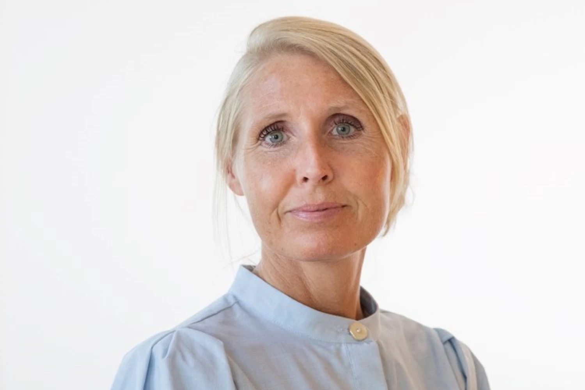

Denne arbejdspakke undersøger betydningen af at have T2DM under en graviditet. 
Der er flere studier i arbejdspakken, herunder et klinisk studie, der undersøger mekanismerne bag insulinresistens i graviditeten, flere epidemiologiske studier, der undersøger de sundhedsmæssige konsekvenserne af en graviditet kompliceret af type-2 diabetes både for mor og barn. Arbejdspakken skaber ny viden, som kan styrke klinisk praksis og støtte kvinderne og deres børn gennem livet.

*Nedenfor beskrives kort nogle af de studier, som hører til i arbejdspakken:*

**Danske kvinders oplevelser med at være gravide og have type 2 diabetes**
Dette antropologiske studie undersøger, hvordan danske kvinder oplever og håndterer det at være gravide og have type 2 diabetes, samt hvordan kvinderne rådgives og vejledes af medicinere, fødselslæger og diætister på Aarhus Universitetshospital. Undersøgelsen foregår med brug af interview og deltagerobservation. 

**Udførende forsker:** Julie Høgsgaard Andersen, antropolog, ph.d. 📧 julane@rm.dk

**Projekt titel?**
Ved hjælp af registerbaserede data undersøges konsekvenserne af tidlig type 2-diabetes. Som en del af projektet etableres DiGMA-databasen (Diabetes i Graviditeten, Mor og bArn), som indeholder oplysninger om alle fødsler i Danmark fra 2000 til i dag samt data om sygelighed, dødelighed, laboratoriedata, vækst og socioøkonomiske forhold. DiGMA-databasen vil danne grundlag for studier af morbiditet og mortalitet hos mødre og børn samt børnenes postnatale vækst i graviditeter kompliceret af tidlig type 2-diabetes hos moderen.

**Udførende forsker:** Sine Knorr, titel 📧 sine.knorr@clin.au.dk

**Projekt titel?**
Der er begrænset viden om betydningen af tidlig debut af type 2-diabetes for kvinders langsigtede helbred og for sundhedsvæsenet, særligt i relation til graviditet og graviditetskomplikationer. Kvinder med tidligt debuteret type 2-diabetes kan opleve en større samlet byrde af diabetesrelaterede og andre kroniske sygdomme, hvilket potentielt kan føre til øget multimorbiditet og større brug af sundhedsydelser.
Ved hjælp af data fra DiGMA-databasen sammenlignes forekomsten af multimorbiditet og anvendelsen af sundhedsydelser mellem kvinder med type 2-diabetes, som har gennemgået en graviditet, og kvinder med normoglykæmisk graviditet, samt mellem kvinder med type 2-diabetes med og uden graviditetskomplikationer.
Studiet vil bidrage med viden om den langsigtede sygdomsbyrde og de sundhedsrelaterede behov forbundet med type 2-diabetes hos kvinder i den reproduktive alder og kan være med til at informere klinisk praksis og planlægning i sundhedsvæsenet.

**Udførende forsker:** Elpida Vounzoulaki, titel 📧 evn@ph.au.dk

**Projektets titel?** 
Det overordnede formål med projektet er at forbedre forståelsen af, hvordan moderens metaboliske sundhed under graviditeten påvirker graviditetsforløb og udfald hos afkommet samt at belyse de underliggende biologiske mekanismer.

Projektet kombinerer landsdækkende registerdata med longitudinelle kliniske og biokemiske vurderinger for at undersøge konsekvenserne af og mekanismerne bag maternel metabolisk dysfunktion. Ved hjælp af data fra DiGMA-databasen karakteriseres sygelighed og dødelighed blandt børn eksponeret for maternel type 2-diabetes, samtidig med at longitudinelle hormonelle og inflammatoriske profiler undersøges på tværs af metaboliske fænotyper hos gravide kvinder, fra normalvægtige og overvægtige kvinder uden sygdom til kvinder med graviditetsdiabetes eller type 2-diabetes.

Samlet vil disse komplementære tilgange bidrage med både populationsbaseret og mekanistisk viden om betydningen af moderens metaboliske sundhed med henblik på at identificere mekanismer bag ugunstige udfald samt understøtte fremtidige strategier for forebyggelse og risikostratificering blandt gravide kvinder med type 2-diabetes.

**Udførende forsker:** Laura ??, titel?? 📧 mail??

## Kontakt arbejdspakkeleder 

::: {layout-ncol="2"}
-   Ulla Kampmann Opstrup
-   Overlæge
-   Steno Diabetes Center Aarhus 
-   📧 **ullaopst@rm.dk**

{.profile-picture}
:::

