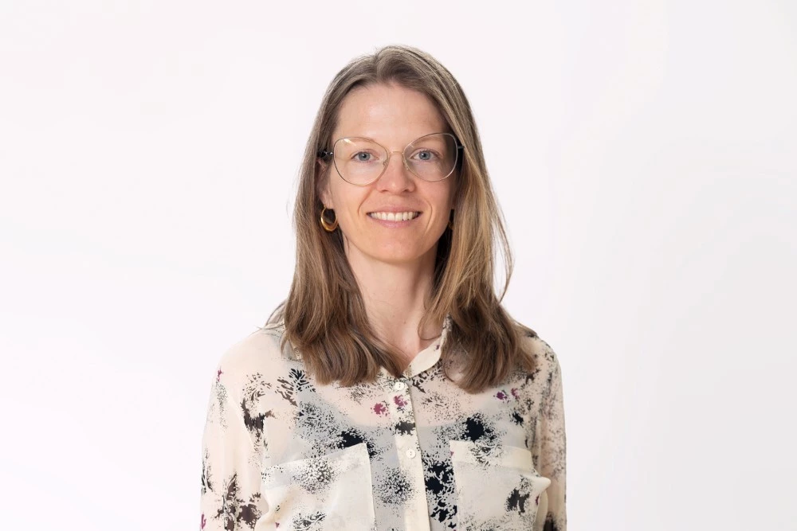

Denne arbejdspakke undersøger betydningen af at have T2DM under en graviditet. 
Der er flere studier i arbejdspakken, herunder et klinisk studie, der undersøger mekanismerne bag insulinresistens i graviditeten, flere epidemiologiske studier, der undersøger de sundhedsmæssige konsekvenserne af en graviditet kompliceret af type-2 diabetes både for mor og barn. Arbejdspakken skaber ny viden, som kan styrke klinisk praksis og støtte kvinderne og deres børn gennem livet.

**Nedenfor beskrives kort nogle af studier, som hører til i arbejdspakken:**

*Danske kvinders oplevelser med at være gravide og have type 2 diabetes*
Dette antropologiske studie undersøger, hvordan danske kvinder oplever og håndterer det at være gravide og have type 2 diabetes, samt hvordan kvinderne rådgives og vejledes af medicinere, fødselslæger og diætister på Aarhus Universitetshospital. Undersøgelsen foregår med brug af interview og deltagerobservation. 

Udførende forsker: **Julie Høgsgaard Andersen**, antropolog, ph.d. 📧 **julane@rm.dk**

*Projekt titel?* 
Ved hjælp af registerbaserede data undersøges konsekvenserne af tidlig type 2-diabetes. Som en del af projektet etableres DiGMA-databasen (Diabetes i Graviditeten, Mor og bArn), som indeholder oplysninger om alle fødsler i Danmark fra 2000 til i dag samt data om sygelighed, dødelighed, laboratoriedata, vækst og socioøkonomiske forhold. DiGMA-databasen vil danne grundlag for studier af morbiditet og mortalitet hos mødre og børn samt børnenes postnatale vækst i graviditeter kompliceret af tidlig type 2-diabetes hos moderen.

Udførende forsker: **Sine Knorr**, titel 📧 **sine.knorr@clin.au.dk**

## Kontakt arbejdspakkeleder 

::: {layout-ncol="2"}
-   Ulla Kampmann Opstrup
-   Overlæge
-   Steno Diabetes Center Aarhus 
-   📧 **ullaopst@rm.dk**

{.profile-picture}
:::

## Kontakt kvalitativ forsker 

::: {layout-ncol="2"}
-   Julie Høgsgaard Andersen
-   Antropolog, ph.d.
-   Steno Diabetes Center Aarhus 
-   📧 **julane@rm.dk**

{.profile-picture}
:::
