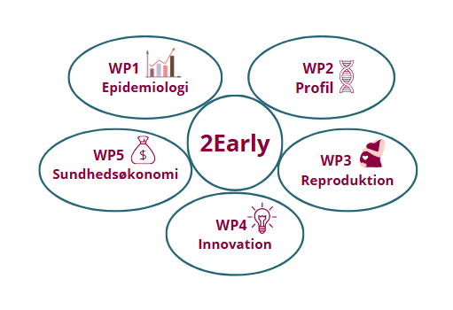

{fig-alt="Illustration af projektets arbejdspakker"}

# Velkommen

Denne hjemmeside samler information om projekt *2Early*. 

Projektet består af 5 arbejdspakker, som arbejder ind i projetket samlet formål om at styrke forståelsen af tidligt opstået type 2-diabetes og bidrage til bedre forebyggelse, diagnostik og behandling. 

Gennem tværfaglig forskning undersøger vi de faktorer, der påvirker sygdomsbyrde og komplikationer, med det mål at forbedre livskvaliteten for mennesker med EoT2D.

{fig-alt="regionmidt logo"}
